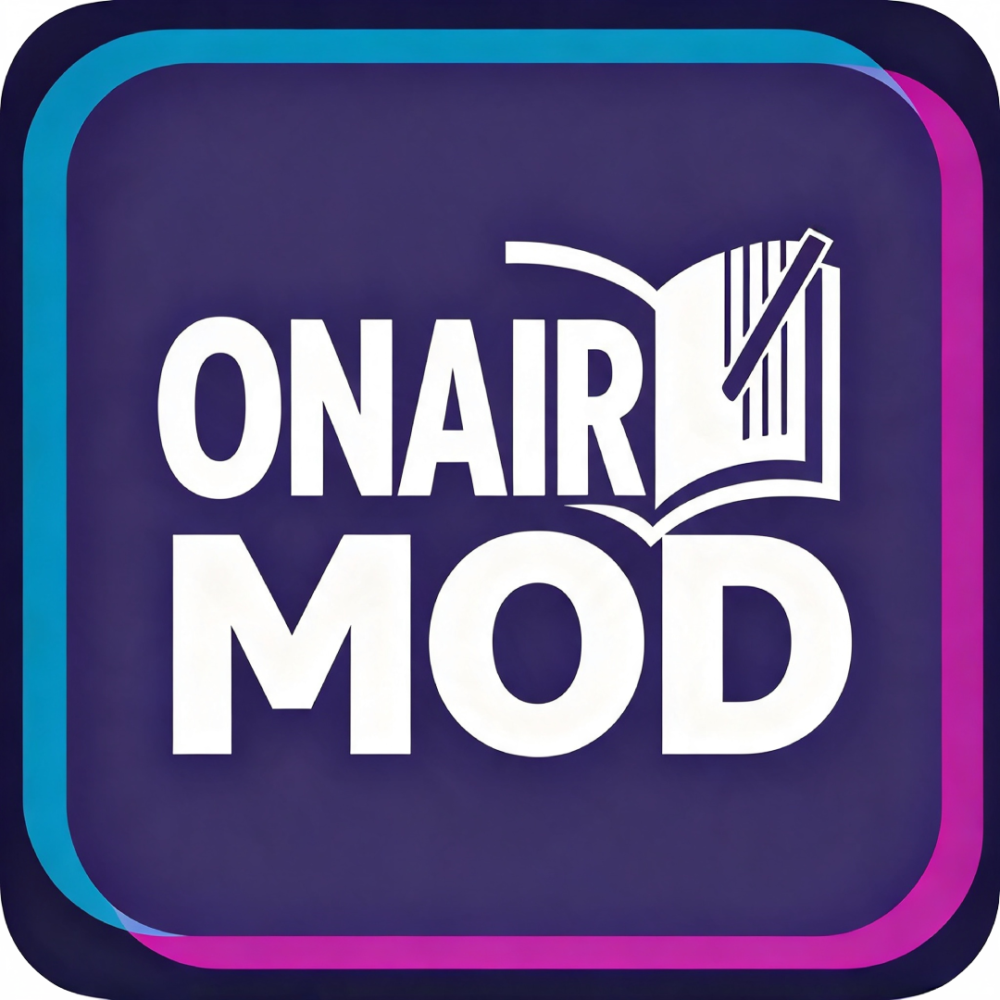

<div align="center">
  <a href="https://github.com/coonlink">
    
  </a>
  <h1>Chill with You : Lo-Fi Story — Мод «Всегда на связи»</h1>

  [](README.md)
  [](README.ru.md)

  
  
  
  
  
</div>

<br />

<div align="center">
  <p>Убирает <b>скриптовый разрыв связи</b> на 32-м эпизоде — с героиней можно продолжать разговаривать.</p>
</div>

## Требования

1. Игра **Chill with You : Lo-Fi Story** (Steam), запущенная хотя бы один раз.
2. **BepInEx 5.x** в папке игры
   → `.../Chill with You Lo-Fi Story/BepInEx/`
   (установщик ставит его автоматически, если его нет — например, после
   переустановки игры).
3. Файл плагина `AlwaysConnectedPlugin.dll` (этот мод).

Больше ничего не нужно. Мод правит код игры в памяти и не меняет ни одного
файла игры.

## Скачать

Готовый к запуску zip выложен **только** в GitHub Releases:

👉 [github.com/crc137/Chill-With-You-Always-Connected-Mod/releases](https://github.com/crc137/Chill-With-You-Always-Connected-Mod/releases)

Берите `ChillWithYou-AlwaysConnected-v26.1.0-Linux-Windows.zip`. В самом
репозитории — только исходники, установщики и документация, без бинарников.

## Как установить (игроку, сборка не нужна)

**Вариант A — установщик в один клик (рекомендую)**

Распакуйте zip и запустите установщик для своей ОС:

- **Windows:** двойной клик по `install.bat`
- **Linux / Steam Deck:** `./install.sh`

Установщик найдёт игру в **любой Steam-библиотеке** (включая нестандартные пути
и внешние диски), сам поставит BepInEx, если его нет, и скопирует мод в
`BepInEx/plugins`. Если игра не нашлась — спросит путь вручную.

**Вариант B — вручную**

1. Установите игру через Steam и **один раз** запустите её, чтобы создались папки.
2. Положите **BepInEx 5.x** в папку игры:
   - Windows: `Chill with You Lo-Fi Story/BepInEx/`
   - Steam Deck / Linux (flatpak):
     `~/.var/app/com.valvesoftware.Steam/.local/share/Steam/steamapps/common/Chill with You Lo-Fi Story/BepInEx/`
3. Скопируйте плагин в папку **plugins**:
   ```
   BepInEx/plugins/AlwaysConnectedPlugin.dll     ← сам мод
   ```

Удаляется обратно через `uninstall.sh` / `uninstall.bat`.

## Как выключить мод, не удаляя его

Разрыв связи — задуманное событие, поэтому иногда хочется один раз посмотреть
на оригинал или записать его на видео. Файлы переносить не надо — достаточно
переключить настройку:

- **Linux / Steam Deck:** `./mod.sh on` · `./mod.sh off` · `./mod.sh status`
- **Windows:** поправить конфиг руками, см. ниже

Игру перед переключением надо закрыть, иначе она перезапишет конфиг при выходе.

## Настройки

`BepInEx/config/crc137.chillwithyou.alwaysconnected.cfg`

| Параметр | По умолчанию | Что делает |
| --- | --- | --- |
| `SkipConnectionLost` | `true` | Главный переключатель. `false` возвращает оригинальное поведение без удаления мода. |
| `VerboseState` | `false` | Пишет состояние связи героини раз в 10 с в `BepInEx/LogOutput.log`. Только для отладки. |

## Как увидеть оригинальное событие снова

Разрыв срабатывает только пока `NextEpisodeNumber == 32`. После того как вы
прочитали 32-й эпизод, он больше не сработает никогда — поэтому для записи или
скриншотов сейв нужно отмотать назад:

```
python3 tools/reset-episode.py --status   # показать текущий прогресс
python3 tools/reset-episode.py            # вернуть 32-й эпизод
```

Скрипт кладёт рядом с файлом сохранения резервную копию с меткой времени
`.before-reset-*`. Игру перед запуском надо закрыть, иначе она перезапишет
изменение при выходе.

## Если не работает

- **Разрыв всё равно происходит** → проверьте, что в
  `BepInEx/config/crc137.chillwithyou.alwaysconnected.cfg` стоит
  `SkipConnectionLost = true`, и что вы запускали игру **после** установки мода.
- **Ничего не происходит, мода нет** → скорее всего, не загрузился BepInEx. В
  папке игры должен быть `BepInEx/core`. Если вы только что переустановили игру,
  запустите `install.sh` / `install.bat` ещё раз — он восстановит BepInEx и мод.
- **Нужно убедиться, что мод активен** → поставьте `VerboseState = true` и
  смотрите `BepInEx/LogOutput.log`: при старте должны появиться строки
  `[AlwaysConnected] patched: ...`.
- **Нет консоли BepInEx** → включите `[Logging.Console] Enabled = true` в
  `BepInEx/config/BepInEx.cfg`.

## Что это за событие на самом деле

Это не баг и не случайность. Игра сама назначает разрыв связи после 31-го
эпизода:

- `GamePlayingDefectDirection.CheckNeedUseDefectDirection()` возвращает
  `ConnectionLost`, когда `NextEpisodeNumber == 32`. В `DirectionService.cs` поле
  подписано `31話読了後用切断演出` — «отключение после 31-го эпизода».
- `UseConnectionLost()` поднимает оверлей, включает глитч и роняет аудио-фильтры
  низких частот.
- `HeroineService.Setup()` подписывается на это состояние и замораживает героиню:
  `_animator.speed = 0f` и `_heroineAI.SetIsUse(false)`.
- Разговор блокируется сразу в нескольких местах, например в
  `PlayerStatusReactionTalkController` и `RoomGameManager`.

Поверх этого есть ещё один барьер. На 32-м эпизоде
`ScenarioProgressData.IsPossibleTalkNextMainEpisode()` возвращает `true` только
после того, как выставится `CanShowConnectionLostNextEpisode`, а для этого нужно
**50 минут** накопленной работы в pomodoro
(`TimerCoreService.UpdateLastStoryUnlockFlg`). Возврат связи привязан к
33 уровню (`MyDefine.IsPossibleReconnectLevel`).

## Что меняет мод

Три патча Harmony:

| Метод | Эффект |
| --- | --- |
| `GamePlayingDefectDirection.CheckNeedUseDefectDirection` | переписывает `ConnectionLost` в `None`, разрыв не начинается |
| `GamePlayingDefectDirection.PlayDefectDirection` | если разрыв всё же применился, отыгрывает его как `None` — срабатывает штатный `Init()` игры и снимает оверлей, аудио и реактивный флаг |
| `ScenarioProgressData.IsPossibleTalkNextMainEpisode` | возвращает `true` на 32-м эпизоде, пропуская ожидание 50 минут |

Дополнительно `ConnectionWatchdog` раз в 2 секунды перепроверяет состояние
героини, чтобы разрыв, который всё же проскочил, был снят, а не оставил её
замороженной.

Отдельный эффект `AlwaysNoise` на 31-м эпизоде намеренно не тронут.

Патчится только `Assembly-CSharp`. Файлы игры не изменяются.

## Сборка из исходников

Нужен .NET SDK и скрипт `build.sh`, который собирает мод, копирует плагин рядом с
игрой и упаковывает релизный zip:

```bash
./build.sh
```

Проверено на сборке игры от 9/10/2026, Unity 2022.3.62, BepInEx 5.4.23.5,
Mono 6.14 (Steam Deck / Proton).
